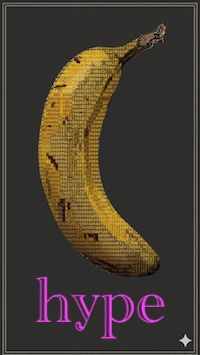
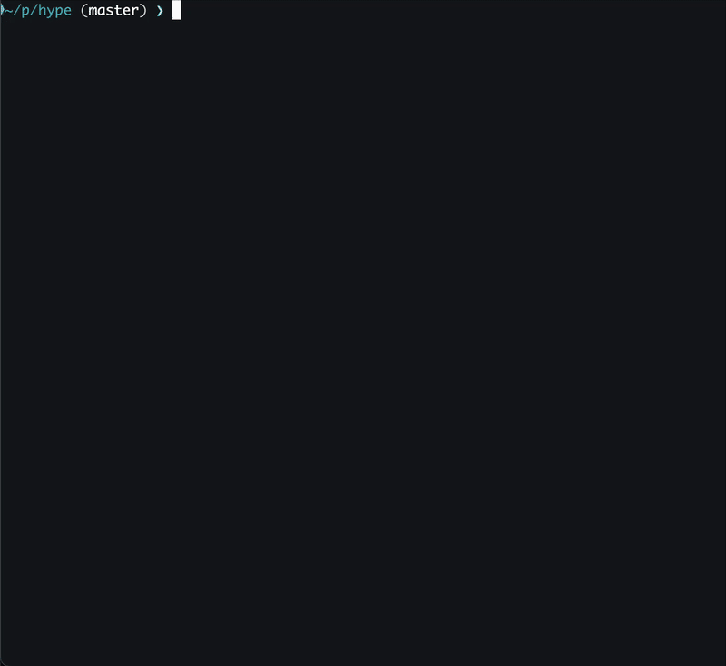

# hype

A terminal text art generator that renders images as colored text.





## Install

### From source

Install [Rust](https://rust-lang.org/tools/install), then:

```bash
cargo install --path .
```

## Usage

Run `hype help`

## Features

### Rendering modes

- **Block** — Uses Unicode half-block characters (`▀`/`▄`) to pack two vertical pixels per character cell with independent foreground and background colors. This is the default mode and produces the highest fidelity output.
- **Braille** — Maps 2x4 pixel blocks to Unicode braille characters (U+2800–U+28FF), giving a dot-matrix look. Each cell is colored by the average color of its lit dots. A configurable brightness threshold controls which dots are lit.
- **ASCII** — Renders using a range of ASCII characters selected by luminance, for compatibility with any terminal or font.

### Color modes

- **Truecolor (24-bit)** — Full RGB color via ANSI escape sequences. Auto-detected from the `COLORTERM` environment variable.
- **256-color** — Maps colors to the ANSI 256-color palette (6x6x6 color cube + grayscale ramp) using perceptually-weighted nearest-match. Used as the fallback when truecolor is not detected.
- **Grayscale** — Renders using only grayscale values.

### Dithering (256-color block mode)

- **Floyd-Steinberg** — Error-diffusion dithering for smooth gradients.
- **Ordered (Bayer 4x4)** — Patterned dithering for a stylized, halftone-like look.

### Other capabilities

- **Alpha compositing** — Transparent regions can be composited against a configurable background color (black, white, or any RGB value). Without a background, transparency is preserved as the terminal's own background.
- **Auto-sizing** — Output dimensions default to the terminal width with aspect ratio preserved. Width and height can also be set explicitly.
- **Input image format support** — PNG, JPEG, GIF, BMP, and WebP.

## Acknowledgements

This project was written by Claude with human supervision. The first working version only took 1 hour!